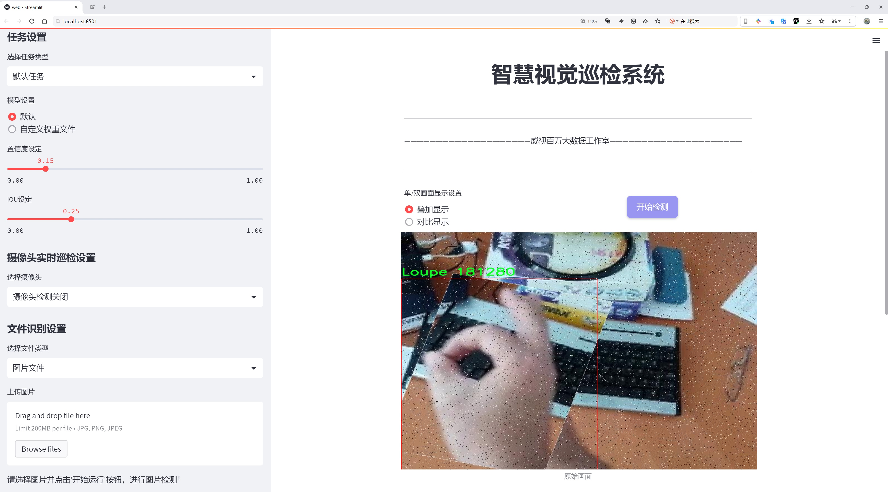
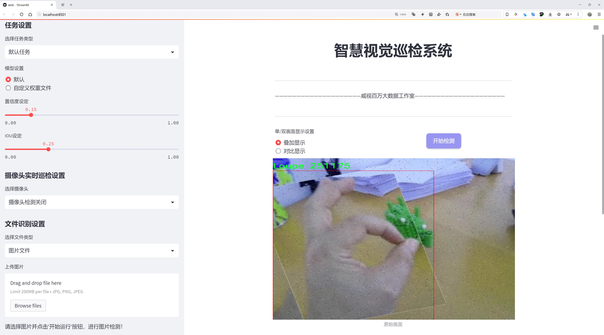
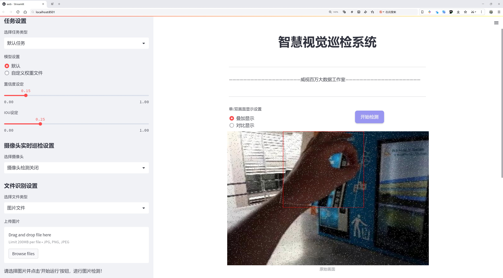
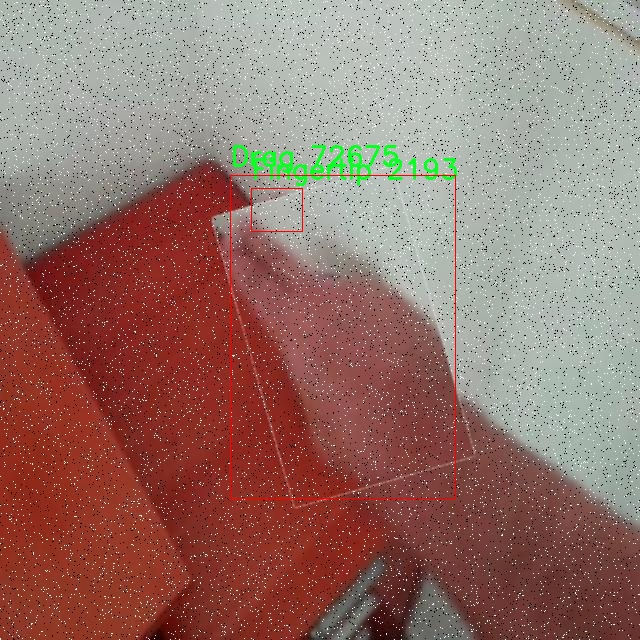
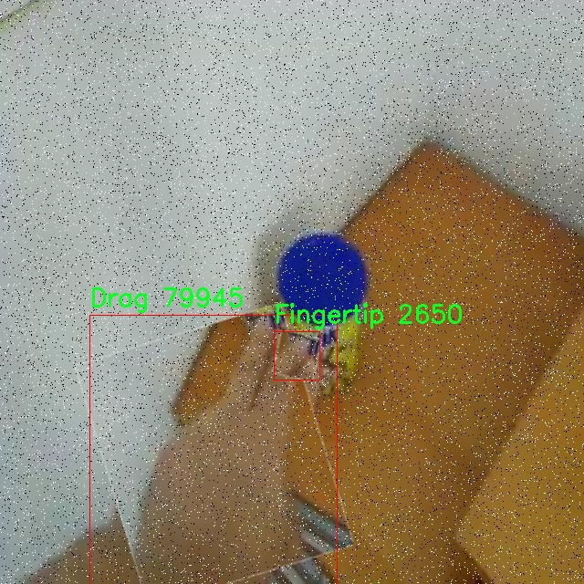
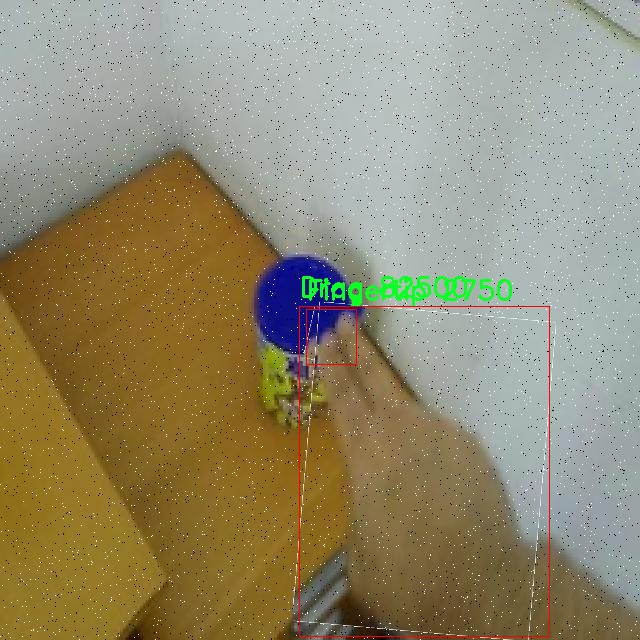
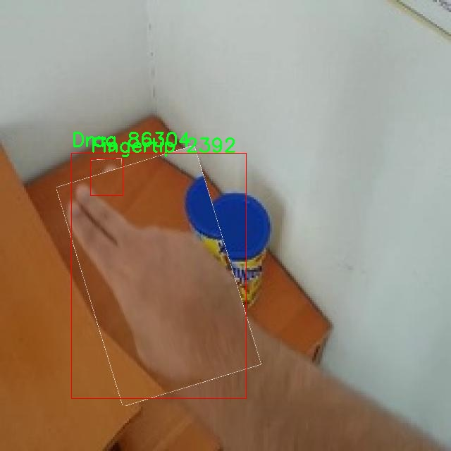
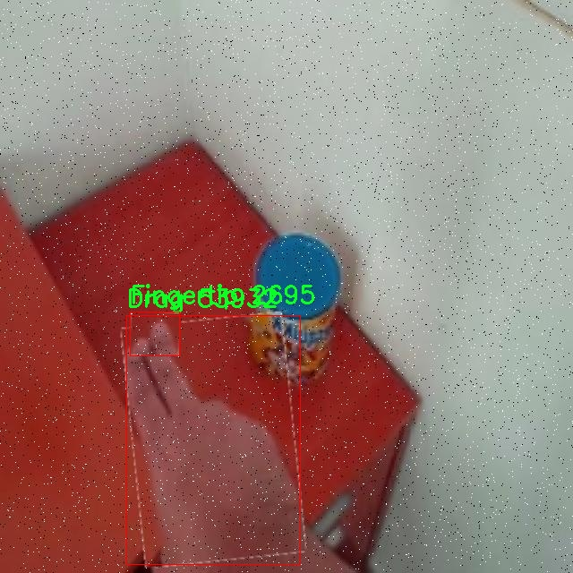

# 手势操作控制检测系统源码分享
 # [一条龙教学YOLOV8标注好的数据集一键训练_70+全套改进创新点发刊_Web前端展示]

### 1.研究背景与意义

项目参考[AAAI Association for the Advancement of Artificial Intelligence](https://gitee.com/qunmasj/projects)

项目来源[AACV Association for the Advancement of Computer Vision](https://github.com/qunshansj/good)

### 研究背景与意义

随着人工智能技术的迅猛发展，计算机视觉领域的研究不断取得突破，尤其是在物体检测和图像识别方面。YOLO（You Only Look Once）系列模型因其高效的实时处理能力和优越的检测精度，已成为目标检测领域的佼佼者。最新的YOLOv8模型在速度和准确性上均有显著提升，使其在各类应用场景中表现出色。然而，尽管YOLOv8在标准数据集上表现优异，但在特定应用场景下，尤其是手势识别和操作控制系统中，仍然存在一定的局限性。

手势操作控制系统作为人机交互的重要方式，能够通过识别用户的手势来实现对设备的控制，具有广泛的应用前景，如智能家居、虚拟现实、增强现实等领域。传统的手势识别方法往往依赖于复杂的传感器和专用硬件，成本高且不够灵活。而基于YOLOv8的手势识别系统，利用深度学习技术，可以在普通摄像头下实现高效的手势识别，降低了硬件成本，提升了系统的普适性和可用性。

本研究将基于改进的YOLOv8模型，构建一个高效的手势操作控制系统。我们使用的自定义数据集包含3999张图像，涵盖324个类别，涉及多种办公环境和物品。这一丰富的数据集为模型的训练提供了良好的基础，使其能够在复杂的背景下准确识别手势和物体。通过对数据集的分析，我们发现手势识别不仅需要关注手的形状和位置，还需考虑周围环境的影响。因此，在模型的改进过程中，我们将结合图像的上下文信息，提升模型对手势的识别能力。

研究的意义在于，不仅为手势识别技术的发展提供了新的思路，还为实际应用提供了切实可行的解决方案。通过改进YOLOv8模型，我们期望能够在实时性和准确性之间找到更好的平衡，使得手势操作控制系统能够在实际应用中更为流畅和自然。此外，本研究还将推动智能交互技术的发展，助力智能家居、医疗健康、教育等多个领域的创新应用。

综上所述，基于改进YOLOv8的手势操作控制系统的研究，不仅具有重要的理论价值，还有广泛的实际应用前景。通过深入探讨手势识别技术的关键问题，我们希望能够为未来的智能交互系统奠定坚实的基础，推动人机交互技术的进一步发展。

### 2.图片演示







##### 注意：由于此博客编辑较早，上面“2.图片演示”和“3.视频演示”展示的系统图片或者视频可能为老版本，新版本在老版本的基础上升级如下：（实际效果以升级的新版本为准）

  （1）适配了YOLOV8的“目标检测”模型和“实例分割”模型，通过加载相应的权重（.pt）文件即可自适应加载模型。

  （2）支持“图片识别”、“视频识别”、“摄像头实时识别”三种识别模式。

  （3）支持“图片识别”、“视频识别”、“摄像头实时识别”三种识别结果保存导出，解决手动导出（容易卡顿出现爆内存）存在的问题，识别完自动保存结果并导出到tempDir中。

  （4）支持Web前端系统中的标题、背景图等自定义修改，后面提供修改教程。

  另外本项目提供训练的数据集和训练教程,暂不提供权重文件（best.pt）,需要您按照教程进行训练后实现图片演示和Web前端界面演示的效果。

### 3.视频演示

[3.1 视频演示](https://www.bilibili.com/video/BV1XcHPe5ECv/?vd_source=ff015de2d29cbe2a9cdbfa7064407a08)

### 4.数据集信息展示

数据集信息展示

在现代计算机视觉领域，手势识别技术的应用日益广泛，尤其是在智能交互、虚拟现实和增强现实等场景中。为了有效训练和改进YOLOv8手势操作控制系统，我们构建了一个名为“Custom Yolo”的数据集。该数据集专门针对手势识别任务进行了精心设计，旨在提升系统对不同手势的识别精度和响应速度。

“Custom Yolo”数据集包含三种主要类别，分别是“Drag”、“Fingertip”和“Loupe”。每一类别都代表了一种特定的手势操作，具有独特的特征和应用场景。“Drag”手势通常用于在界面上移动对象，用户通过手指在屏幕上滑动来实现拖动操作。这种手势在图形用户界面中非常常见，能够提供直观的交互体验。“Fingertip”手势则代表了用户用手指轻触屏幕的动作，通常用于选择或激活某个功能或对象。此手势的准确识别对于实现快速、精准的用户交互至关重要。“Loupe”手势则模拟了放大镜的效果，用户通过特定的手势在屏幕上放大某个区域，以便更清晰地查看细节。这种手势在图像处理和查看细节时非常有用，能够提升用户的操作效率。

数据集的构建过程包括了多种手势的采集和标注。我们通过多种设备和环境条件下收集了大量的手势图像，以确保数据集的多样性和代表性。每一类手势都经过了严格的标注，确保模型在训练过程中能够准确学习到不同手势的特征。此外，为了提高模型的鲁棒性，我们还对数据集进行了数据增强处理，包括旋转、缩放、平移和颜色变换等。这些增强技术不仅增加了数据集的样本数量，还有效提高了模型对不同场景和条件下手势的识别能力。

在数据集的使用过程中，我们将其分为训练集、验证集和测试集，以便于对模型的性能进行全面评估。训练集用于模型的学习，验证集用于调整模型参数，而测试集则用于最终的性能评估。通过这种方式，我们能够确保模型在未见数据上的泛化能力，从而提高其在实际应用中的表现。

总之，“Custom Yolo”数据集为改进YOLOv8手势操作控制系统提供了坚实的基础。通过对三种手势的精确标注和多样化的数据采集，我们期望能够显著提升手势识别的准确性和实时性，为用户提供更加流畅和自然的交互体验。随着技术的不断进步和数据集的不断完善，我们相信该系统将在智能交互领域发挥越来越重要的作用。











### 5.全套项目环境部署视频教程（零基础手把手教学）

[5.1 环境部署教程链接（零基础手把手教学）](https://www.ixigua.com/7404473917358506534?logTag=c807d0cbc21c0ef59de5)


[5.2 安装Python虚拟环境创建和依赖库安装视频教程链接（零基础手把手教学）](https://www.ixigua.com/7404474678003106304?logTag=1f1041108cd1f708b01a)

### 6.手把手YOLOV8训练视频教程（零基础小白有手就能学会）

[6.1 环境部署教程链接（零基础手把手教学）](https://www.ixigua.com/7404477157818401292?logTag=d31a2dfd1983c9668658)

### 7.70+种全套YOLOV8创新点代码加载调参视频教程（一键加载写好的改进模型的配置文件）

[7.1 环境部署教程链接（零基础手把手教学）](https://www.ixigua.com/7404478314661806627?logTag=29066f8288e3f4eea3a4)

### 8.70+种全套YOLOV8创新点原理讲解（非科班也可以轻松写刊发刊，V10版本正在科研待更新）

由于篇幅限制，每个创新点的具体原理讲解就不一一展开，具体见下列网址中的创新点对应子项目的技术原理博客网址【Blog】：


[8.1 70+种全套YOLOV8创新点原理讲解链接](https://gitee.com/qunmasj/good)

### 9.系统功能展示（检测对象为举例，实际内容以本项目数据集为准）

图9.1.系统支持检测结果表格显示

  图9.2.系统支持置信度和IOU阈值手动调节

  图9.3.系统支持自定义加载权重文件best.pt(需要你通过步骤5中训练获得)

  图9.4.系统支持摄像头实时识别

  图9.5.系统支持图片识别

  图9.6.系统支持视频识别

  图9.7.系统支持识别结果文件自动保存

  图9.8.系统支持Excel导出检测结果数据


### 10.原始YOLOV8算法原理

原始YOLOv8算法原理

YOLOv8算法是由Glenn-Jocher提出的最新版本，延续了YOLO系列的优良传统，尤其是YOLOv3和YOLOv5的核心思想，同时在多个方面进行了创新和改进。作为一种基于卷积神经网络的目标检测算法，YOLOv8的设计目标是提高检测精度和速度，使其能够在各种实际应用场景中表现出色。

首先，YOLOv8在数据预处理方面继续采用YOLOv5的策略，结合了多种数据增强技术。这些技术包括马赛克增强、混合增强、空间扰动和颜色扰动等，旨在通过丰富训练数据的多样性来提高模型的泛化能力。马赛克增强通过将多张图像拼接在一起，增加了图像的复杂性和多样性，从而帮助模型更好地学习不同物体的特征。混合增强则通过将不同图像的特征进行融合，进一步增强了模型对不同场景的适应能力。空间扰动和颜色扰动则是通过对图像进行随机变换和颜色调整，增加了训练数据的多样性，帮助模型更好地应对现实世界中的变化。

在骨干网络结构方面，YOLOv8继承了YOLOv5的设计理念，采用了类似的卷积层和模块结构。然而，YOLOv8对C3模块进行了替换，采用了新的C2f模块。C2f模块引入了更多的分支，丰富了梯度回传时的支流，从而提高了特征提取的效率和准确性。这种设计使得网络在处理复杂场景时能够更好地捕捉到重要的特征信息，从而提升了目标检测的性能。

YOLOv8依然采用了特征金字塔网络（FPN）和路径聚合网络（PAN）结构，以实现多尺度信息的充分融合。通过这种结构，YOLOv8能够在不同尺度上提取特征，并将其有效地整合在一起，从而提高对小物体和大物体的检测能力。虽然FPN-PAN结构中的C3模块被替换为C2f模块，但整体架构与YOLOv5保持一致，这种继承性确保了YOLOv8在保留前期成果的基础上，进一步优化了性能。

在检测头的设计上，YOLOv8采用了解耦合头结构，这一创新使得分类和定位任务能够在两个独立的分支中进行处理。通过这种解耦合的方式，YOLOv8能够更有效地提取类别特征和位置特征，从而提高检测的准确性。此外，YOLOv8在检测过程中摒弃了传统的锚框（Anchor-Based）策略，转而采用了锚框自由（Anchor-Free）的方法，这一变化进一步简化了模型的设计，并提升了检测效率。

在标签分配策略方面，YOLOv8采用了动态标签分配策略TOOD，与YOLOv6相似。这种策略解决了正负样本匹配的多尺度分配问题，避免了传统方法中可能出现的候选框不准确的问题。YOLOv8的损失函数主要包括类别损失和位置损失，其中类别损失采用了变焦损失（VFL Loss），而回归损失则结合了CIoU Loss和DFL Loss。VFL Loss通过不对称参数对正负样本进行加权，增强了模型对高质量样本的关注度，同时降低了负样本对损失的影响。这种设计使得YOLOv8在训练过程中能够更有效地学习到目标的特征，从而提高了检测精度。

YOLOv8的整体网络结构经过精心设计，包含输入端、主干网络和检测端三个部分。模型提供了多种不同规模的版本，以适应不同的应用需求。这些版本在深度、特征图宽度等方面进行了优化，以实现最佳的性能表现。YOLOv8的引入不仅在精度和速度上取得了显著提升，还为智能监控、自动驾驶、人脸识别等多个领域的应用提供了强有力的支持。

总的来说，YOLOv8算法通过对数据预处理、骨干网络结构、特征融合、检测头设计和标签分配策略等多个方面的改进，成功地提升了目标检测的性能。其创新的设计理念和高效的网络结构，使得YOLOv8在目标检测领域中占据了重要的位置，成为研究和应用的热门选择。随着YOLOv8的广泛应用，未来的目标检测技术将更加高效、准确，为各行各业的智能化发展提供更为坚实的基础。


### 11.项目核心源码讲解（再也不用担心看不懂代码逻辑）

#### 11.1 ultralytics\models\yolo\detect\train.py

以下是对代码中最核心部分的提取和详细中文注释：

```python
import random
import numpy as np
import torch.nn as nn
from ultralytics.data import build_dataloader, build_yolo_dataset
from ultralytics.engine.trainer import BaseTrainer
from ultralytics.models import yolo
from ultralytics.nn.tasks import DetectionModel
from ultralytics.utils import LOGGER, RANK
from ultralytics.utils.torch_utils import de_parallel, torch_distributed_zero_first

class DetectionTrainer(BaseTrainer):
    """
    DetectionTrainer类，继承自BaseTrainer，用于基于检测模型的训练。
    """

    def build_dataset(self, img_path, mode="train", batch=None):
        """
        构建YOLO数据集。

        参数:
            img_path (str): 包含图像的文件夹路径。
            mode (str): 模式，`train`或`val`，用户可以为每种模式自定义不同的增强。
            batch (int, optional): 批量大小，仅用于`rect`模式。默认为None。
        """
        gs = max(int(de_parallel(self.model).stride.max() if self.model else 0), 32)
        return build_yolo_dataset(self.args, img_path, batch, self.data, mode=mode, rect=mode == "val", stride=gs)

    def get_dataloader(self, dataset_path, batch_size=16, rank=0, mode="train"):
        """构造并返回数据加载器。"""
        assert mode in ["train", "val"]
        with torch_distributed_zero_first(rank):  # 如果使用DDP，仅初始化数据集一次
            dataset = self.build_dataset(dataset_path, mode, batch_size)
        shuffle = mode == "train"  # 训练模式下打乱数据
        workers = self.args.workers if mode == "train" else self.args.workers * 2
        return build_dataloader(dataset, batch_size, workers, shuffle, rank)  # 返回数据加载器

    def preprocess_batch(self, batch):
        """对一批图像进行预处理，包括缩放和转换为浮点数。"""
        batch["img"] = batch["img"].to(self.device, non_blocking=True).float() / 255  # 将图像转换为浮点数并归一化
        if self.args.multi_scale:  # 如果启用多尺度训练
            imgs = batch["img"]
            sz = (
                random.randrange(self.args.imgsz * 0.5, self.args.imgsz * 1.5 + self.stride)
                // self.stride
                * self.stride
            )  # 随机选择新的尺寸
            sf = sz / max(imgs.shape[2:])  # 计算缩放因子
            if sf != 1:
                ns = [
                    math.ceil(x * sf / self.stride) * self.stride for x in imgs.shape[2:]
                ]  # 计算新的形状
                imgs = nn.functional.interpolate(imgs, size=ns, mode="bilinear", align_corners=False)  # 进行插值
            batch["img"] = imgs
        return batch

    def get_model(self, cfg=None, weights=None, verbose=True):
        """返回YOLO检测模型。"""
        model = DetectionModel(cfg, nc=self.data["nc"], verbose=verbose and RANK == -1)  # 创建检测模型
        if weights:
            model.load(weights)  # 加载权重
        return model

    def get_validator(self):
        """返回YOLO模型验证器。"""
        self.loss_names = "box_loss", "cls_loss", "dfl_loss"  # 定义损失名称
        return yolo.detect.DetectionValidator(
            self.test_loader, save_dir=self.save_dir, args=copy(self.args), _callbacks=self.callbacks
        )

    def plot_training_samples(self, batch, ni):
        """绘制带有注释的训练样本。"""
        plot_images(
            images=batch["img"],
            batch_idx=batch["batch_idx"],
            cls=batch["cls"].squeeze(-1),
            bboxes=batch["bboxes"],
            paths=batch["im_file"],
            fname=self.save_dir / f"train_batch{ni}.jpg",
            on_plot=self.on_plot,
        )
```

### 代码核心部分分析：
1. **数据集构建** (`build_dataset`): 该方法负责根据输入路径和模式构建YOLO数据集，支持训练和验证模式。
2. **数据加载器获取** (`get_dataloader`): 该方法构造数据加载器，支持多进程加载和数据打乱。
3. **批处理预处理** (`preprocess_batch`): 该方法对输入的图像批次进行预处理，包括归一化和多尺度调整。
4. **模型获取** (`get_model`): 该方法返回一个YOLO检测模型，并可以加载预训练权重。
5. **验证器获取** (`get_validator`): 该方法返回一个用于模型验证的验证器。
6. **绘制训练样本** (`plot_training_samples`): 该方法用于可视化训练样本及其注释，便于观察训练效果。

这些方法是实现YOLO模型训练的核心，涵盖了数据处理、模型构建和结果可视化等关键步骤。

该文件是Ultralytics YOLO（You Only Look Once）模型的训练模块，主要用于目标检测任务。文件中定义了一个名为`DetectionTrainer`的类，该类继承自`BaseTrainer`，用于构建和训练YOLO检测模型。

在这个类中，首先定义了`build_dataset`方法，用于构建YOLO数据集。该方法接收图像路径、模式（训练或验证）和批量大小作为参数，使用`build_yolo_dataset`函数生成数据集。数据集的构建会根据模型的步幅（stride）进行调整，以确保图像尺寸符合要求。

接着，`get_dataloader`方法用于创建数据加载器。该方法会根据传入的模式（训练或验证）构建相应的数据集，并设置是否打乱数据的顺序。它还会根据训练模式的不同调整工作线程的数量。

`preprocess_batch`方法用于对输入的图像批次进行预处理，包括将图像缩放到适当的大小并转换为浮点数格式。该方法支持多尺度训练，随机选择图像的尺寸进行训练，以增强模型的鲁棒性。

`set_model_attributes`方法用于设置模型的属性，包括类别数量和类别名称。这些信息会被附加到模型中，以便在训练过程中使用。

`get_model`方法用于返回一个YOLO检测模型实例，可以根据配置文件和权重文件加载模型。

`get_validator`方法返回一个用于验证YOLO模型的验证器，主要用于在训练后评估模型的性能。

`label_loss_items`方法用于返回带有标签的训练损失项字典，这对于目标检测任务是必要的。它将损失项转换为浮点数并以特定格式返回。

`progress_string`方法用于生成训练进度的格式化字符串，显示当前的训练轮次、GPU内存使用情况、损失值、实例数量和图像大小等信息。

`plot_training_samples`方法用于绘制训练样本及其注释，生成的图像将保存到指定的目录中。

最后，`plot_metrics`和`plot_training_labels`方法分别用于绘制训练过程中的指标和创建带标签的训练图，帮助用户可视化训练效果和模型性能。

总体而言，该文件提供了YOLO模型训练所需的核心功能，包括数据集构建、数据加载、模型设置、损失计算和可视化等，旨在帮助用户高效地训练目标检测模型。

#### 11.2 ui.py

```python
import sys
import subprocess

def run_script(script_path):
    """
    使用当前 Python 环境运行指定的脚本。

    Args:
        script_path (str): 要运行的脚本路径

    Returns:
        None
    """
    # 获取当前 Python 解释器的路径
    python_path = sys.executable

    # 构建运行命令
    command = f'"{python_path}" -m streamlit run "{script_path}"'

    # 执行命令
    result = subprocess.run(command, shell=True)
    if result.returncode != 0:
        print("脚本运行出错。")


# 实例化并运行应用
if __name__ == "__main__":
    # 指定您的脚本路径
    script_path = "web.py"  # 这里直接指定脚本路径

    # 运行脚本
    run_script(script_path)
```

### 代码注释说明：

1. **导入模块**：
   - `import sys`：导入系统相关的模块，用于获取当前 Python 解释器的路径。
   - `import subprocess`：导入子进程模块，用于在 Python 中执行外部命令。

2. **定义函数 `run_script`**：
   - 函数接受一个参数 `script_path`，表示要运行的 Python 脚本的路径。
   - 使用 `sys.executable` 获取当前 Python 解释器的路径，以便后续构建运行命令。

3. **构建命令**：
   - 使用 f-string 格式化字符串，构建运行命令，命令格式为：`python -m streamlit run <script_path>`，其中 `<script_path>` 是传入的脚本路径。

4. **执行命令**：
   - 使用 `subprocess.run` 执行构建好的命令，`shell=True` 表示在 shell 中执行命令。
   - 检查命令执行的返回码，如果不为 0，表示脚本运行出错，打印错误信息。

5. **主程序入口**：
   - `if __name__ == "__main__":`：确保只有在直接运行该脚本时才会执行以下代码。
   - 指定要运行的脚本路径 `script_path`，这里直接设置为 `"web.py"`。
   - 调用 `run_script` 函数，传入脚本路径以执行该脚本。

这个程序文件名为 `ui.py`，其主要功能是使用当前的 Python 环境来运行一个指定的脚本。代码中首先导入了必要的模块，包括 `sys`、`os` 和 `subprocess`，以及一个自定义模块 `QtFusion.path` 中的 `abs_path` 函数。

在 `run_script` 函数中，首先定义了一个参数 `script_path`，用于接收要运行的脚本的路径。函数内部首先获取当前 Python 解释器的路径，这通过 `sys.executable` 实现。接着，构建了一个命令字符串，该命令使用 `streamlit` 来运行指定的脚本。`streamlit` 是一个用于构建数据应用的库，命令的格式为 `python -m streamlit run "script_path"`。

然后，使用 `subprocess.run` 方法来执行这个命令，`shell=True` 表示在一个新的 shell 中执行该命令。执行后，程序会检查返回的状态码，如果状态码不为 0，表示脚本运行出错，程序会输出一条错误信息。

在文件的最后部分，使用 `if __name__ == "__main__":` 语句来确保只有在直接运行该文件时才会执行以下代码。这里指定了要运行的脚本路径，调用 `abs_path` 函数获取 `web.py` 的绝对路径，并最终调用 `run_script` 函数来执行这个脚本。

整体来看，这个程序的主要作用是为用户提供一个简便的方式来运行 `web.py` 脚本，利用 `streamlit` 库创建数据应用。

#### 11.3 ultralytics\utils\callbacks\neptune.py

以下是经过简化和注释的核心代码部分：

```python
# 导入必要的库
from ultralytics.utils import LOGGER, SETTINGS, TESTS_RUNNING

# 尝试导入 NeptuneAI 相关库并进行初始化
try:
    assert not TESTS_RUNNING  # 确保不是在测试环境中
    assert SETTINGS["neptune"] is True  # 确保启用了 Neptune 集成
    import neptune
    from neptune.types import File

    assert hasattr(neptune, "__version__")  # 确保 Neptune 库的版本存在

    run = None  # 初始化 NeptuneAI 实验记录实例

except (ImportError, AssertionError):
    neptune = None  # 如果导入失败，则将 neptune 设置为 None


def _log_scalars(scalars, step=0):
    """将标量数据记录到 NeptuneAI 实验记录器中。"""
    if run:  # 如果 run 实例存在
        for k, v in scalars.items():  # 遍历标量字典
            run[k].append(value=v, step=step)  # 记录每个标量值


def _log_images(imgs_dict, group=""):
    """将图像记录到 NeptuneAI 实验记录器中。"""
    if run:  # 如果 run 实例存在
        for k, v in imgs_dict.items():  # 遍历图像字典
            run[f"{group}/{k}"].upload(File(v))  # 上传每个图像文件


def on_pretrain_routine_start(trainer):
    """在训练例程开始前调用的回调函数。"""
    try:
        global run
        # 初始化 Neptune 运行实例
        run = neptune.init_run(project=trainer.args.project or "YOLOv8", name=trainer.args.name, tags=["YOLOv8"])
        # 记录超参数配置
        run["Configuration/Hyperparameters"] = {k: "" if v is None else v for k, v in vars(trainer.args).items()}
    except Exception as e:
        LOGGER.warning(f"WARNING ⚠️ NeptuneAI 安装但未正确初始化，未记录此运行。 {e}")


def on_train_epoch_end(trainer):
    """每个训练周期结束时调用的回调函数。"""
    # 记录训练损失和学习率
    _log_scalars(trainer.label_loss_items(trainer.tloss, prefix="train"), trainer.epoch + 1)
    _log_scalars(trainer.lr, trainer.epoch + 1)
    if trainer.epoch == 1:  # 在第一个周期结束时记录图像
        _log_images({f.stem: str(f) for f in trainer.save_dir.glob("train_batch*.jpg")}, "Mosaic")


def on_train_end(trainer):
    """训练结束时调用的回调函数。"""
    if run:  # 如果 run 实例存在
        # 记录最终结果、混淆矩阵和 PR 图
        files = [
            "results.png",
            "confusion_matrix.png",
            "confusion_matrix_normalized.png",
            *(f"{x}_curve.png" for x in ("F1", "PR", "P", "R")),
        ]
        # 过滤存在的文件
        files = [(trainer.save_dir / f) for f in files if (trainer.save_dir / f).exists()]
        for f in files:
            _log_plot(title=f.stem, plot_path=f)  # 记录每个图表
        # 记录最终模型
        run[f"weights/{trainer.args.name or trainer.args.task}/{trainer.best.name}"].upload(File(str(trainer.best)))


# 定义回调函数字典，如果 neptune 可用则包含相关回调
callbacks = (
    {
        "on_pretrain_routine_start": on_pretrain_routine_start,
        "on_train_epoch_end": on_train_epoch_end,
        "on_fit_epoch_end": on_fit_epoch_end,
        "on_val_end": on_val_end,
        "on_train_end": on_train_end,
    }
    if neptune
    else {}
)
```

### 代码注释说明：
1. **导入库**：导入了 Ultralytics 的工具和 NeptuneAI 相关的库。
2. **异常处理**：尝试导入 NeptuneAI 并进行必要的检查，如果失败则将 `neptune` 设置为 `None`。
3. **记录函数**：定义了 `_log_scalars` 和 `_log_images` 函数，用于记录标量和图像数据到 NeptuneAI。
4. **回调函数**：定义了多个回调函数，这些函数在训练的不同阶段被调用，以记录超参数、损失、学习率、图像等信息。
5. **回调字典**：根据 `neptune` 是否可用来决定是否包含相关的回调函数。

这个程序文件是用于与NeptuneAI进行集成的回调函数实现，主要用于在训练YOLO模型时记录实验数据和结果。文件中首先导入了一些必要的模块，并尝试初始化NeptuneAI的实验记录器。如果NeptuneAI未正确安装或未启用，则会捕获相应的异常并将`neptune`设置为`None`。

在文件中定义了一些私有函数，用于记录不同类型的数据。`_log_scalars`函数用于记录标量数据，例如损失值和学习率；`_log_images`函数用于记录图像数据，特别是训练过程中的图像；`_log_plot`函数用于记录绘图数据，如训练过程中的图表。

接下来，定义了一些回调函数，这些函数会在特定的训练阶段被调用。`on_pretrain_routine_start`函数在训练开始前被调用，负责初始化NeptuneAI的实验记录器并记录超参数配置。`on_train_epoch_end`函数在每个训练周期结束时被调用，记录训练损失和学习率，并在第一个周期结束时记录训练图像。`on_fit_epoch_end`函数在每个适应周期结束时被调用，记录模型信息和训练指标。`on_val_end`函数在每次验证结束时被调用，记录验证图像。`on_train_end`函数在训练结束时被调用，记录最终结果、混淆矩阵和PR曲线，并上传最佳模型权重。

最后，文件定义了一个`callbacks`字典，其中包含了所有的回调函数，如果NeptuneAI未启用，则该字典为空。这些回调函数将在训练过程中被相应的事件触发，以便记录实验的各个方面。

#### 11.4 ultralytics\engine\trainer.py

以下是代码中最核心的部分，并附上详细的中文注释：

```python
class BaseTrainer:
    """
    BaseTrainer类是训练器的基类，负责模型的训练过程。
    """

    def __init__(self, cfg=DEFAULT_CFG, overrides=None, _callbacks=None):
        """
        初始化BaseTrainer类。

        参数:
            cfg (str, optional): 配置文件的路径，默认为DEFAULT_CFG。
            overrides (dict, optional): 配置覆盖，默认为None。
        """
        self.args = get_cfg(cfg, overrides)  # 获取配置
        self.check_resume(overrides)  # 检查是否需要恢复训练
        self.device = select_device(self.args.device, self.args.batch)  # 选择训练设备
        self.validator = None  # 验证器实例
        self.metrics = None  # 训练指标
        self.plots = {}  # 存储绘图数据
        init_seeds(self.args.seed + 1 + RANK, deterministic=self.args.deterministic)  # 初始化随机种子

        # 创建保存结果的目录
        self.save_dir = get_save_dir(self.args)
        self.args.name = self.save_dir.name  # 更新日志名称
        self.wdir = self.save_dir / "weights"  # 权重保存目录
        if RANK in (-1, 0):
            self.wdir.mkdir(parents=True, exist_ok=True)  # 创建目录
            self.args.save_dir = str(self.save_dir)
            yaml_save(self.save_dir / "args.yaml", vars(self.args))  # 保存运行参数
        self.last, self.best = self.wdir / "last.pt", self.wdir / "best.pt"  # 检查点路径
        self.save_period = self.args.save_period  # 保存周期

        self.batch_size = self.args.batch  # 批次大小
        self.epochs = self.args.epochs  # 训练轮数
        self.start_epoch = 0  # 起始轮数
        if RANK == -1:
            print_args(vars(self.args))  # 打印参数

        # 设备设置
        if self.device.type in ("cpu", "mps"):
            self.args.workers = 0  # CPU训练时不使用多线程

        # 模型和数据集
        self.model = check_model_file_from_stem(self.args.model)  # 检查模型文件
        try:
            if self.args.task == "classify":
                self.data = check_cls_dataset(self.args.data)  # 检查分类数据集
            elif self.args.data.split(".")[-1] in ("yaml", "yml") or self.args.task in ("detect", "segment", "pose"):
                self.data = check_det_dataset(self.args.data)  # 检查检测数据集
                if "yaml_file" in self.data:
                    self.args.data = self.data["yaml_file"]  # 更新数据路径
        except Exception as e:
            raise RuntimeError(emojis(f"数据集 '{clean_url(self.args.data)}' 错误 ❌ {e}")) from e

        self.trainset, self.testset = self.get_dataset(self.data)  # 获取训练和测试数据集
        self.ema = None  # 指数移动平均

        # 优化工具初始化
        self.lf = None  # 损失函数
        self.scheduler = None  # 学习率调度器

        # 轮次级别的指标
        self.best_fitness = None  # 最佳适应度
        self.fitness = None  # 当前适应度
        self.loss = None  # 当前损失
        self.tloss = None  # 总损失
        self.loss_names = ["Loss"]  # 损失名称列表
        self.csv = self.save_dir / "results.csv"  # 结果CSV文件路径
        self.plot_idx = [0, 1, 2]  # 绘图索引

        # 回调函数
        self.callbacks = _callbacks or callbacks.get_default_callbacks()  # 获取默认回调
        if RANK in (-1, 0):
            callbacks.add_integration_callbacks(self)  # 添加集成回调

    def train(self):
        """开始训练过程。"""
        # 计算世界大小（用于多GPU训练）
        if isinstance(self.args.device, str) and len(self.args.device):
            world_size = len(self.args.device.split(","))
        elif isinstance(self.args.device, (tuple, list)):
            world_size = len(self.args.device)
        elif torch.cuda.is_available():
            world_size = 1  # 默认使用设备0
        else:
            world_size = 0  # 使用CPU

        # 如果是DDP训练，运行子进程，否则正常训练
        if world_size > 1 and "LOCAL_RANK" not in os.environ:
            cmd, file = generate_ddp_command(world_size, self)  # 生成DDP命令
            try:
                LOGGER.info(f'{colorstr("DDP:")} 调试命令 {" ".join(cmd)}')
                subprocess.run(cmd, check=True)  # 运行命令
            except Exception as e:
                raise e
            finally:
                ddp_cleanup(self, str(file))  # 清理DDP

        else:
            self._do_train(world_size)  # 执行训练

    def _do_train(self, world_size=1):
        """执行训练，完成后评估和绘图。"""
        if world_size > 1:
            self._setup_ddp(world_size)  # 设置DDP
        self._setup_train(world_size)  # 设置训练

        nb = len(self.train_loader)  # 批次数量
        self.run_callbacks("on_train_start")  # 运行训练开始回调
        LOGGER.info(f'开始训练 {self.epochs} 轮...')

        for epoch in range(self.start_epoch, self.epochs):
            self.epoch = epoch
            self.run_callbacks("on_train_epoch_start")  # 运行每轮开始回调
            self.model.train()  # 设置模型为训练模式
            pbar = enumerate(self.train_loader)  # 训练进度条

            self.optimizer.zero_grad()  # 清空梯度
            for i, batch in pbar:
                self.run_callbacks("on_train_batch_start")  # 运行每批次开始回调

                # 前向传播
                with torch.cuda.amp.autocast(self.amp):
                    batch = self.preprocess_batch(batch)  # 预处理批次
                    self.loss, self.loss_items = self.model(batch)  # 计算损失

                # 反向传播
                self.scaler.scale(self.loss).backward()  # 缩放损失并反向传播

                # 优化步骤
                self.optimizer_step()  # 执行优化步骤

                # 日志记录
                if RANK in (-1, 0):
                    pbar.set_description(f"训练进度: {epoch + 1}/{self.epochs}")

            self.run_callbacks("on_train_epoch_end")  # 运行每轮结束回调

        self.run_callbacks("on_train_end")  # 运行训练结束回调

    def optimizer_step(self):
        """执行优化器的单步更新，包括梯度裁剪和EMA更新。"""
        self.scaler.unscale_(self.optimizer)  # 反缩放梯度
        torch.nn.utils.clip_grad_norm_(self.model.parameters(), max_norm=10.0)  # 裁剪梯度
        self.scaler.step(self.optimizer)  # 更新优化器
        self.scaler.update()  # 更新缩放器
        self.optimizer.zero_grad()  # 清空梯度
        if self.ema:
            self.ema.update(self.model)  # 更新EMA

    def validate(self):
        """
        在测试集上运行验证，返回指标和适应度。
        """
        metrics = self.validator(self)  # 使用验证器进行验证
        fitness = metrics.pop("fitness", -self.loss.detach().cpu().numpy())  # 获取适应度
        if not self.best_fitness or self.best_fitness < fitness:
            self.best_fitness = fitness  # 更新最佳适应度
        return metrics, fitness  # 返回指标和适应度
```

### 代码核心部分解释
1. **BaseTrainer类**：这是训练器的基类，负责模型的训练过程，初始化配置、设备选择、数据集检查等。
2. **train方法**：开始训练过程，设置多GPU训练或单GPU训练。
3. **_do_train方法**：执行训练过程，进行多轮训练，处理每个批次的数据，计算损失，进行反向传播和优化。
4. **optimizer_step方法**：执行优化器的单步更新，包括梯度裁剪和EMA更新。
5. **validate方法**：在测试集上进行验证，返回训练指标和适应度。

通过这些核心部分，BaseTrainer类能够有效地管理训练过程，确保模型在给定数据集上的训练和验证。

这个程序文件 `ultralytics/engine/trainer.py` 是用于训练 YOLO（You Only Look Once）模型的核心代码。该文件包含了一个名为 `BaseTrainer` 的类，它为模型训练提供了基础框架和功能。以下是对代码的详细讲解。

首先，文件导入了一些必要的库和模块，包括数学运算、文件操作、时间处理、警告管理、深度学习框架 PyTorch 及其相关模块等。这些导入为后续的模型训练提供了基础支持。

`BaseTrainer` 类是整个训练过程的核心，包含了多个属性和方法。类的初始化方法 `__init__` 中，首先通过 `get_cfg` 函数获取训练配置，并检查是否需要从上次的检查点恢复训练。接着，选择设备（如 CPU 或 GPU）并初始化随机种子，以确保训练的可重复性。

在初始化过程中，还会创建保存结果的目录，并设置模型和数据集。模型通过 `check_model_file_from_stem` 函数进行检查和加载，数据集则通过 `check_cls_dataset` 或 `check_det_dataset` 函数进行验证和加载。

`BaseTrainer` 类中定义了多个方法，其中 `train` 方法是训练的入口。该方法首先判断是否使用多 GPU 进行训练，并根据情况生成相应的命令行参数。接着，调用 `_do_train` 方法开始训练过程。

在 `_do_train` 方法中，首先会设置分布式训练的参数，然后初始化训练所需的模型、数据加载器和优化器。训练过程中，模型会在每个 epoch 中进行前向传播、计算损失、反向传播和优化步骤。训练的进度会通过日志进行记录，并在每个 epoch 结束时进行验证和模型保存。

`save_model` 方法用于保存训练的检查点，包括当前的模型状态、优化器状态、训练参数和训练指标等。模型会根据最佳的 fitness 值进行保存，以便后续的使用和评估。

此外，类中还定义了一些辅助方法，例如 `validate` 用于在验证集上评估模型性能，`build_optimizer` 用于构建优化器，`get_dataset` 用于获取训练和验证数据集的路径等。

总的来说，这个文件实现了 YOLO 模型训练的完整流程，包括数据准备、模型构建、训练过程管理、损失计算、优化器更新和模型保存等功能，为用户提供了一个高效的训练框架。

#### 11.5 ultralytics\utils\patches.py

以下是代码中最核心的部分，并附上详细的中文注释：

```python
import cv2
import numpy as np
import torch

# 读取图像文件的函数
def imread(filename: str, flags: int = cv2.IMREAD_COLOR):
    """
    从文件中读取图像。

    参数:
        filename (str): 要读取的文件路径。
        flags (int, optional): 图像读取标志，默认为 cv2.IMREAD_COLOR。

    返回:
        (np.ndarray): 读取的图像。
    """
    # 使用 cv2.imdecode 读取图像，np.fromfile 处理文件路径以支持多语言
    return cv2.imdecode(np.fromfile(filename, np.uint8), flags)

# 保存图像到文件的函数
def imwrite(filename: str, img: np.ndarray, params=None):
    """
    将图像写入文件。

    参数:
        filename (str): 要写入的文件路径。
        img (np.ndarray): 要写入的图像。
        params (list of ints, optional): 额外参数，具体见 OpenCV 文档。

    返回:
        (bool): 如果文件写入成功则返回 True，否则返回 False。
    """
    try:
        # 使用 cv2.imencode 将图像编码并写入文件
        cv2.imencode(Path(filename).suffix, img, params)[1].tofile(filename)
        return True
    except Exception:
        return False

# 显示图像的函数
def imshow(winname: str, mat: np.ndarray):
    """
    在指定窗口中显示图像。

    参数:
        winname (str): 窗口名称。
        mat (np.ndarray): 要显示的图像。
    """
    # 使用 OpenCV 的 imshow 函数显示图像
    cv2.imshow(winname.encode("unicode_escape").decode(), mat)

# 保存 PyTorch 模型的函数
def torch_save(*args, **kwargs):
    """
    使用 dill 序列化 lambda 函数，并在保存失败时进行重试以提高鲁棒性。

    参数:
        *args (tuple): 传递给 torch.save 的位置参数。
        **kwargs (dict): 传递给 torch.save 的关键字参数。
    """
    try:
        import dill as pickle  # 尝试导入 dill 模块
    except ImportError:
        import pickle  # 如果没有 dill，则使用 pickle

    # 如果没有指定 pickle_module，则使用默认的 pickle
    if "pickle_module" not in kwargs:
        kwargs["pickle_module"] = pickle

    for i in range(4):  # 进行 3 次重试
        try:
            return torch.save(*args, **kwargs)  # 调用 torch.save 保存模型
        except RuntimeError:  # 如果保存失败，可能是设备未刷新或防病毒软件正在扫描
            if i == 3:
                raise  # 如果是最后一次重试，则抛出异常
            time.sleep((2**i) / 2)  # 指数退避策略：0.5s, 1.0s, 2.0s
```

### 代码核心部分说明：
1. **imread**: 读取图像文件，支持多语言文件路径。
2. **imwrite**: 将图像保存到指定文件，处理文件后缀。
3. **imshow**: 在窗口中显示图像，支持 Unicode 窗口名称。
4. **torch_save**: 封装 PyTorch 的保存功能，增加了对 lambda 函数的支持和保存失败的重试机制。

这个程序文件 `ultralytics/utils/patches.py` 主要用于扩展和更新现有函数的功能，特别是针对图像处理和PyTorch模型保存的操作。文件中包含了一些对OpenCV和PyTorch函数的“猴子补丁”（monkey patching），这是一种在运行时动态修改类或模块的方法。

首先，文件导入了一些必要的库，包括 `time`、`Path`、`cv2`、`numpy` 和 `torch`。这些库提供了图像处理和深度学习所需的基本功能。

在OpenCV相关的部分，定义了三个函数：`imread`、`imwrite` 和 `imshow`。`imread` 函数用于从文件中读取图像，支持通过 `flags` 参数指定读取方式，默认是以彩色模式读取。这个函数使用 `cv2.imdecode` 和 `np.fromfile` 组合来处理文件读取，确保在不同平台上都能正常工作。

`imwrite` 函数则用于将图像写入文件。它接收文件名、图像数据和可选的参数，使用 `cv2.imencode` 将图像编码并写入指定路径。该函数通过异常处理来确保在写入失败时返回 `False`，从而提高了代码的健壮性。

`imshow` 函数用于在指定窗口中显示图像。它通过将窗口名称编码为Unicode格式来避免潜在的递归错误。

在PyTorch相关的部分，定义了一个 `torch_save` 函数，它是对 `torch.save` 的封装。这个函数的主要目的是使用 `dill` 库来序列化那些 `pickle` 无法处理的 lambda 函数，并在保存失败时进行多次重试，以提高保存操作的可靠性。重试机制采用指数退避策略，首次重试等待0.5秒，第二次等待1秒，第三次等待2秒。

总的来说，这个文件通过对常用函数的扩展和改进，提升了图像处理和模型保存的灵活性和可靠性，适用于Ultralytics YOLO项目中的图像处理和模型管理任务。

#### 11.6 train.py

以下是代码中最核心的部分，并附上详细的中文注释：

```python
import os
import torch
import yaml
from ultralytics import YOLO  # 导入YOLO模型
from QtFusion.path import abs_path  # 导入路径处理工具

# 检查是否有可用的GPU，如果有则使用GPU，否则使用CPU
device = "0" if torch.cuda.is_available() else "cpu"

if __name__ == '__main__':  # 确保该模块被直接运行时才执行以下代码
    workers = 1  # 设置数据加载的工作进程数
    batch = 2    # 设置每个批次的大小

    data_name = "data"  # 数据集名称
    # 获取数据集配置文件的绝对路径
    data_path = abs_path(f'datasets/{data_name}/{data_name}.yaml', path_type='current')  
    unix_style_path = data_path.replace(os.sep, '/')  # 将路径转换为Unix风格

    # 获取数据集目录路径
    directory_path = os.path.dirname(unix_style_path)
    
    # 读取YAML文件，保持原有顺序
    with open(data_path, 'r') as file:
        data = yaml.load(file, Loader=yaml.FullLoader)
    
    # 如果YAML文件中包含'path'项，则修改为当前目录路径
    if 'path' in data:
        data['path'] = directory_path
        # 将修改后的数据写回YAML文件
        with open(data_path, 'w') as file:
            yaml.safe_dump(data, file, sort_keys=False)

    # 加载预训练的YOLOv8模型
    model = YOLO(model='./ultralytics/cfg/models/v8/yolov8s.yaml', task='detect')  
    
    # 开始训练模型
    results2 = model.train(
        data=data_path,  # 指定训练数据的配置文件路径
        device=device,  # 指定使用的设备（GPU或CPU）
        workers=workers,  # 指定使用的工作进程数
        imgsz=640,  # 指定输入图像的大小为640x640
        epochs=100,  # 指定训练的轮数为100
        batch=batch,  # 指定每个批次的大小
        name='train_v8_' + data_name  # 指定训练任务的名称
    )
```

### 代码核心部分说明：
1. **导入库**：导入必要的库，包括`os`、`torch`、`yaml`和YOLO模型。
2. **设备选择**：根据是否有可用的GPU来选择使用的设备。
3. **数据集路径处理**：获取数据集的YAML配置文件的绝对路径，并读取文件内容。
4. **路径修改**：如果YAML文件中包含`path`项，则将其修改为当前目录路径，并将修改后的内容写回文件。
5. **模型加载**：加载预训练的YOLOv8模型。
6. **模型训练**：使用指定的参数开始训练模型，包括数据路径、设备、工作进程数、图像大小、训练轮数和批次大小。

这段代码是一个用于训练YOLOv8模型的Python脚本，文件名为`train.py`。首先，代码导入了必要的库，包括`os`、`torch`、`yaml`和`ultralytics`中的YOLO模型。接着，代码通过判断CUDA是否可用来选择设备，如果可用则使用GPU（设备编号为"0"），否则使用CPU。

在`__main__`模块中，首先设置了工作进程数量`workers`为1，批次大小`batch`为2。接下来，定义了数据集的名称为`data`，并构建了数据集配置文件的绝对路径。使用`abs_path`函数从`QtFusion.path`模块获取数据集的绝对路径，并将路径中的分隔符统一替换为Unix风格的斜杠。

代码随后获取了目录路径，并打开指定的YAML文件以读取数据。通过`yaml.load`函数将YAML文件内容加载到`data`变量中。接着，检查数据中是否包含`path`项，如果存在，则将其修改为目录路径，并将更新后的数据写回到YAML文件中，确保数据路径的正确性。

接下来，代码加载了YOLOv8模型，指定了模型的配置文件路径和任务类型为检测（`task='detect'`）。然后，调用`model.train`方法开始训练模型，传入多个参数，包括数据配置文件路径、设备、工作进程数量、输入图像大小（640x640）、训练的epoch数量（100）以及批次大小（2）。最后，训练任务的名称由`train_v8_`和数据集名称组合而成。

整个程序的主要功能是准备数据集并启动YOLOv8模型的训练过程，确保在训练之前对数据路径进行正确的设置。

### 12.系统整体结构（节选）

### 程序整体功能和构架概括

该程序是一个基于Ultralytics YOLO（You Only Look Once）模型的目标检测框架，旨在提供一个高效、灵活的训练和推理环境。程序的整体结构分为多个模块，每个模块负责特定的功能，包括模型训练、数据处理、回调记录、图像处理、用户界面等。以下是各个模块的功能概述：

1. **模型训练**：通过`train.py`和`ultralytics/engine/trainer.py`实现，负责数据集准备、模型构建、训练过程管理和模型保存。
2. **回调记录**：通过`ultralytics/utils/callbacks/neptune.py`实现，集成NeptuneAI用于记录训练过程中的指标和结果。
3. **图像处理**：通过`ultralytics/utils/patches.py`实现，扩展OpenCV和PyTorch的功能，提供图像读取、写入和显示的改进。
4. **用户界面**：通过`ui.py`和`ui_style.py`实现，提供一个简单的用户界面来运行和管理训练任务。
5. **工具函数**：包括数据下载、Kalman滤波器等功能，支持模型的各类操作。

### 文件功能整理表

| 文件路径                                          | 功能描述                                                                                   |
|--------------------------------------------------|------------------------------------------------------------------------------------------|
| `ultralytics/models/yolo/detect/train.py`       | 负责YOLO模型的训练，包括数据集构建、模型设置、训练过程管理和损失计算等。               |
| `ui.py`                                          | 提供一个简单的用户界面，允许用户通过命令行运行指定的脚本（如`web.py`）。                |
| `ultralytics/utils/callbacks/neptune.py`       | 集成NeptuneAI，用于记录训练过程中的实验数据和结果，支持标量、图像和图表的记录。       |
| `ultralytics/engine/trainer.py`                 | 定义`BaseTrainer`类，提供训练的基础框架，包括模型构建、数据加载、训练和验证过程。     |
| `ultralytics/utils/patches.py`                  | 扩展OpenCV和PyTorch的功能，提供图像读取、写入和显示的改进，以及增强模型保存的可靠性。   |
| `train.py`                                       | 启动YOLOv8模型的训练过程，准备数据集并设置训练参数。                                   |
| `ultralytics/trackers/utils/kalman_filter.py`   | 实现Kalman滤波器，用于目标跟踪和状态估计。                                             |
| `ultralytics/nn/__init__.py`                    | 初始化神经网络模块，可能包含模型定义和相关函数。                                       |
| `ui_style.py`                                    | 定义用户界面的样式和布局，可能包含样式设置和主题配置。                                   |
| `ultralytics/utils/downloads.py`                | 提供下载功能，支持从网络获取模型权重和数据集等资源。                                   |

这个表格总结了各个文件的主要功能，帮助理解整个程序的结构和功能模块。

注意：由于此博客编辑较早，上面“11.项目核心源码讲解（再也不用担心看不懂代码逻辑）”中部分代码可能会优化升级，仅供参考学习，完整“训练源码”、“Web前端界面”和“70+种创新点源码”以“13.完整训练+Web前端界面+70+种创新点源码、数据集获取”的内容为准。

### 13.完整训练+Web前端界面+70+种创新点源码、数据集获取


https://mbd.pub/o/bread/ZpqYmptv